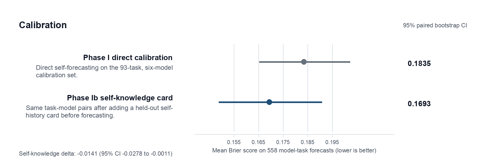
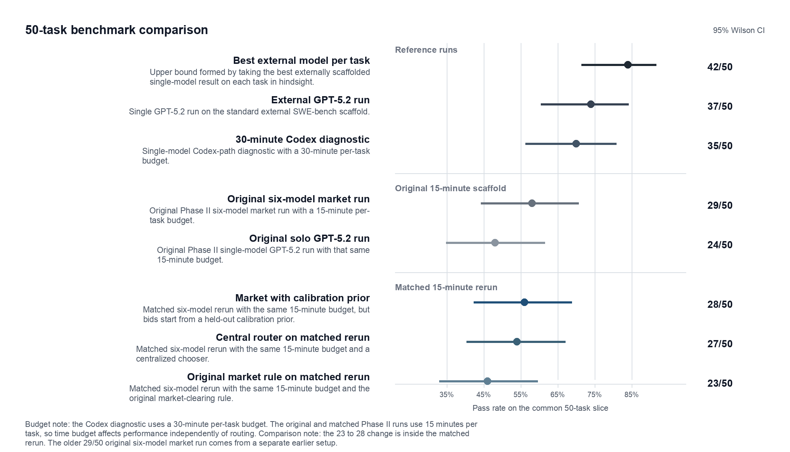

# Agent Economy

A market where AI agents bid, compete, and collaborate on tasks — instead of one agent looping until it gives up.

[github.com/strangeloopcanon/agent-economy](https://github.com/strangeloopcanon/agent-economy)


## Quick Start

```bash
make setup && source .venv/bin/activate
echo "OPENAI_API_KEY=sk-..." > .env

agent-economy task "Add a hello.py that prints Hello World" \
  --workspace-src . \
  --allowed-path . \
  --accept "python hello.py | grep -q 'Hello World'" \
  --rounds 3
```

This decomposes the goal, auctions subtasks to workers, executes in a sandbox, and pays on pass.

Using this from another repo? See the [Cross-Repo Integration Guide](docs/cross_repo_integration.md).

---

## How It Works

A **Planner** breaks a goal into a DAG of tasks. **Workers** (LLMs, scripts, humans) bid on each task with a price, confidence, and their track record. The engine picks the best value-for-risk bid, runs the work in an isolated sandbox, and only pays if an **Oracle** says `PASS`.

Oracles: automated tests (`commands`), LLM consensus (`judges`), or human review (`manual`).

### Scoring

```
score = rep × p_success × bounty − ask − expected_cost − (1 − p_success) × failure_penalty
```

Reputation starts at 1.0 (+0.06 on pass, −0.20 on fail). Failure penalties scale with reputation: new workers face near-zero penalties, established workers up to 50% of the bounty. Overconfident workers who fail pay extra.

### Settlement

Workers pay token costs on every attempt, collect payment only on `PASS`. Everything — bids, patches, verification outcomes — goes into a hash-chained JSONL ledger.

---

## CLI

| Command | What it does |
|---------|-------------|
| `task` | Plan + execute (decomposes goal into subtasks) |
| `oneshot` | Single task, no decomposition |
| `init` + `run` | Create a run from a scenario YAML, then execute |
| `inject` | Add a task to an active run |
| `review` | Manual approve/reject workflow |
| `report` | Summary of a completed run |
| `dashboard` | Real-time web UI on `:8080` |
| `config validate` | Check env/workers/scenarios |

<details>
<summary>Usage examples</summary>

**Full task with multiple allowed paths:**
```bash
agent-economy task "Fix the failing tests" \
  --workspace-src /path/to/repo \
  --allowed-path src/ --allowed-path tests/ \
  --accept "python -m pytest -q" \
  --concurrency 2 --rounds 8
```

**Text-answer task (no code patch):**
```bash
agent-economy task "Explain Raft consensus tradeoffs" \
  --submission-kind text \
  --verify-mode judges \
  --judge-worker gpt-5.2-auto --judge-worker gpt-5-mini \
  --no-self-judge --rounds 3
```

**Inject into a live run:**
```bash
agent-economy inject --run-dir runs/my-run \
  --title "Fix auth bug" --bounty 100 \
  --accept "pytest tests/test_auth.py"
```

</details>

---

## Workers

```json
[
  { "worker_id": "gpt-5-mini", "model_ref": "gpt-5-mini" },
  { "worker_id": "claude-sonnet", "model_ref": "anthropic:claude-sonnet-4-5" },
  { "worker_id": "gemini-pro", "model_ref": "google:gemini-2.5-pro" },
  { "worker_id": "local-script", "exec_cmd": "python my_agent.py", "bid_cmd": "python my_bidder.py" }
]
```

Pass via `--workers workers.json` or set `AE_MODELS_JSON`. Local models work via `ollama:` prefix — see `benchmarks/workers_local_qwen_3b8b.json`.

<details>
<summary>Environment variables</summary>

| Variable | Purpose |
|----------|---------|
| `OPENAI_API_KEY` | OpenAI models |
| `ANTHROPIC_API_KEY` | Anthropic models (`anthropic:` / `claude:` prefix) |
| `GOOGLE_API_KEY` / `GEMINI_API_KEY` | Gemini models (`google:` / `gemini:` prefix) |
| `AE_MODELS_JSON` | Default worker pool |
| `AE_PLANNER_WORKER` | Default planner model |
| `AE_JUDGES_JSON` | Default judge workers |

</details>

---

## Benchmarks

| Scenario | Config | Done | Rounds | Tokens | Cost |
|----------|--------|------|--------|--------|------|
| **SnakeLite** | Baseline | 4/4 | 4 | 9.4k | 10.6 |
| | Market | 4/4 | 4 | 15.6k | 15.5 |
| **SnakeLite + Planner** | Baseline | 0/8 | 30 | 19k | 17.3 |
| | Market | **5/5** | **4** | 29.5k | 23.9 |
| **NanoGPT** | Baseline | 4/4 | 4 | 9k | 9.6 |
| | Market | 4/4 | **3** | 14.2k | 13.4 |
| **KVLite** | Baseline | 6/6 | 7 | 21.6k | 21.5 |
| | Market | 6/6 | **5** | 24.6k | 20.2 |
| **CompilerLite** | Baseline | 2/7 | 120 | 84.5k | 81.7 |
| | Market | 2/7 | 7 | 74.3k | 54.9 |

The market wins on allocation problems — where one agent gets stuck and another could do better. On simpler scenarios both configs finish, but the market needs fewer rounds. Hard tasks stay hard either way, though the market burns fewer tokens failing.

---

## BidBench

BidBench is the calibration benchmark that lives in this repo: can models accurately predict their own probability of success and cost before attempting a task?

This matters for market design. If bids carry real signal, the auction allocates well. If confidence is noise, the market degrades to random assignment with extra overhead.

### Phase I Calibration (93 SWE-bench tasks, 6 models)

558 rows (93 tasks × 6 models). The headline findings:

**Self-assessed confidence was a weak signal.** Most models showed small or negative gaps between mean `p_success` on tasks they passed vs failed. GPT-5-mini had the widest gap (+0.10); two models reported *higher* confidence on tasks they failed.

**Brier skill was near zero or negative.** On the current 558-row calibration file, only Claude Opus 4.5 (+0.060) and Claude Sonnet 4.5 (+0.018) beat a naive base-rate predictor. The rest were worse than always guessing the base rate.

| Model | Brier Skill |
|---|---:|
| Claude Opus 4.5 | +0.060 |
| Claude Sonnet 4.5 | +0.018 |
| GPT-5.2-pro | −0.111 |
| Gemini 3 Pro Preview | −0.111 |
| GPT-5.2 | −0.195 |
| GPT-5-mini | −0.305 |

**Token self-estimates were poor.** In Phase I, the median estimated-to-actual token ratio was `0.1929`. The later Phase Ib self-knowledge rerun improved that to `0.2501`, but forecasts still materially under-shot actual usage.

The saved final calibration dataset is a clean 558-row rerun, but it required repairing an initial Anthropic API-key failure and rerunning the missing rows in place.

**Takeaway:** treat self-assessed confidence as weak signal in auction design; lean on empirical performance history instead.

Full details: [Phase I Calibration](docs/research/report/01_PHASE_1_CALIBRATION.md)

### Phase II: Market vs Solo Evaluation
For the SWE-bench evaluation writeup (market vs solo vs external baselines), see the [Research Report](docs/research/report/00_EXECUTIVE_SUMMARY.md).

#### Calibration summary



Phase I direct calibration is the original 93-task, six-model self-forecasting run. Phase Ib self-knowledge card reruns those same task-model pairs after showing a held-out self-history card. Error bars are 95% paired bootstrap intervals over all 558 forecast rows.

#### 50-task benchmark comparison



This figure separates three families that the old ladder mixed together: reference runs, the original `15` minute Phase II scaffold, and the later matched `15` minute rerun. The key within-family change is `23 / 50` to `28 / 50`: the original market rule on the matched rerun versus the market with a calibration prior. The older `29 / 50` original six-model market run is a separate earlier scaffold run, not the start of that `23 -> 28` sequence.

Label guide:

- `Best external model per task`: the best externally scaffolded single-model result on each task, chosen in hindsight.
- `External GPT-5.2 run`: one fixed GPT-5.2 run on the standard external SWE-bench scaffold.
- `30-minute Codex diagnostic`: single-model Codex-path diagnostic with a `30` minute per-task budget.
- `Original six-model market run`: the original Phase II six-model market run with a `15` minute per-task budget.
- `Original solo GPT-5.2 run`: the original Phase II single-model GPT-5.2 run with that same `15` minute budget.
- `Market with calibration prior`: the matched six-model rerun with the same `15` minute budget, but with a held-out calibration prior added to the bid prompt.
- `Central router on matched rerun`: the matched six-model rerun with the same `15` minute budget and a centralized chooser.
- `Original market rule on matched rerun`: the matched six-model rerun with the same `15` minute budget and the original market-clearing rule.

Time budget matters because it changes how long the worker can keep editing, running tests, and recovering from dead ends. That is why the `30` minute Codex diagnostic sits in the reference group rather than inside the matched `15` minute comparison.

The latest live follow-up is **Phase IId: Market Calibration Intervention**. That run keeps the same six-worker market setup but changes the private bid note so workers start from a held-out calibration prior before bidding. The main Phase IId result is **28 / 50**, versus **23 / 50** for the matched Phase IIb market rerun and **27 / 50** for the matched centralized router. That puts the hard-prior market one task behind the older published market result at **29 / 50**. The detailed Phase II note keeps the audit trail for the follow-up cleanup reruns behind this final Phase IId count: [Phase IIb / IId report](docs/research/report/10_PHASE_2B_CENTRAL_ROUTER_BASELINE_2026-04-07.md).

A later follow-up reran the same 50-task slice through Codex with GPT-5.2 and a 30-minute task budget. That run finished at **35 / 50**, but **20 of those 35 passes** finished after the original 15-minute limit, so it should be read as a longer-budget diagnostic rather than a replacement for the published benchmark. It was also far heavier: **321.3M total tokens**, versus **4.37M** for the published solo GPT-5.2 run and **~5.82M** for the published market run.

### Phase IIa: Informed Competitive Auctions

Phase II's allocation bottleneck (overconfident models stealing assignments) led to a series of three experiments testing how LLMs bid under different economic framings. All used 50 SWE-bench tasks, 3 models (GPT-5.2, Opus, Gemini), and reserve levels of $5 and $10.

The central finding across all three experiments: **prompt design matters more than mechanism design.** Allocation accuracy stays at 62--70% regardless of payment rules; the bottleneck is calibration quality. But how models are instructed to bid dramatically affects behaviour.

Anchoring ratio ($10/$5 ask) went from 2.21x/1.61x/1.05x (first-price) to 0.97x/0.99x/1.08x (second-price with explicit breakeven formula) for GPT-5.2/Opus/Gemini. With all three models competing, Gemini dominates allocation by underbidding ($0.20 vs $0.37/$0.48) but wins tasks it can't solve -- quality signals beyond price are needed.

Full details: [Phase IIa Report](docs/research/report/08_PHASE_2A_COMPETITIVE_AUCTION_2026-02-26.md)

<details>
<summary>Running BidBench</summary>

```bash
# Phase I: calibration elicitation
python scripts/run_phase1.py \
  --swe-manifest benchmarks/swebench/pilot_manifest_v1.json \
  --swe-limit 20 --strategies direct,anchored,cot

# Phase II prep: real SWE instances (93-task manifest, with strict preflight)
python scripts/prepare_phase2_swe.py \
  --task-manifest benchmarks/swebench/phase2_93_manifest_v1.json \
  --preflight --strict-preflight \
  --output-root runs/research/phase2/_prepared/<ts>

# Phase II run: market-only, direct-penalty, first 30 tasks
python scripts/run_phase2.py \
  --task-manifest runs/research/phase2/_prepared/<ts>/prepared_manifest.json \
  --task-offset 0 --task-limit 30 \
  --dag-mode off \
  --market-only --settlement-mode direct_penalty \
  --isolate-state --execute --check-every 25 \
  --output-root runs/research/phase2/<ts>_batch1

# Phase II run: Codex direct as a single external worker
PYTHONPATH=. python -m scripts.run_phase2 \
  --task-manifest runs/research/phase2/_prepared/<ts>/prepared_manifest.json \
  --task-offset 0 --task-limit 1 \
  --workers benchmarks/workers_codex_direct.json \
  --models "" \
  --market-only --settlement-mode direct_penalty \
  --isolate-state --execute \
  --output-root runs/research/phase2/<ts>_codex_direct

# Phase IIa Exp 1: first-price informed bids
python scripts/run_phase1.py \
  --execute-calibration \
  --task-source external_covered_lite --tasks-limit 50 \
  --models "openai:gpt-5.2-2025-12-11,anthropic:claude-opus-4-5-20251101,google:models/gemini-3-pro-preview" \
  --strategies "informed_bid" --reserves "5.0,10.0" \
  --calibration-concurrency 2 \
  --output-root runs/research/phase2a_competitive_50task

# Phase IIa Exp 3: formula second-price (reserve shown + hidden)
python scripts/run_phase1.py \
  --execute-calibration \
  --task-source external_covered_lite --tasks-limit 50 \
  --models "openai:gpt-5.2-2025-12-11,anthropic:claude-opus-4-5-20251101,google:models/gemini-3-pro-preview" \
  --strategies "formula_second_price" --reserves "5.0,10.0" \
  --calibration-concurrency 2 \
  --output-root runs/research/phase2a_formula_sp

# Phase IIa: competitive auction analysis (post-processing, no LLM calls)
python scripts/run_competitive_auction.py \
  --phase1-dir runs/research/phase2a_formula_sp --reserve 5.0
python scripts/run_competitive_auction.py \
  --phase1-dir runs/research/phase2a_formula_sp --reserve 10.0

# Incremental scaling with --resume-from (reuses existing records)
python scripts/run_phase1.py \
  --execute-calibration \
  --task-source external_covered_lite --tasks-limit 80 \
  --strategies "informed_bid" --reserves "5.0,10.0" \
  --resume-from runs/research/phase2a_competitive_50task/calibration_results.jsonl \
  --output-root runs/research/phase2a_competitive_80task
```

Artifacts land in `runs/research/` (local, gitignored).

</details>

### Data

All canonical experiment datasets are committed under [`docs/research/data/`](docs/research/data/):

- [`phase1/`](docs/research/data/phase1/) -- 558-row calibration dataset (93 tasks x 6 models), metrics, external evidence
- [`phase2/`](docs/research/data/phase2/) -- 50-task market-vs-solo summary JSONs
- [`phase2a/`](docs/research/data/phase2a/) -- Phase IIa experiment calibration files (exp1/exp2/exp3) and auction results

---

## Other Surfaces

**RL export** — each attempt as a transition tuple for offline training:
```bash
python scripts/export_transitions.py runs/my-run --jsonl > transitions.jsonl
```

**Safety** — sandboxes are local directories, not VMs. Code runs with your user privileges. `.env` files are not copied into sandboxes.

**Installation** — requires Python 3.11+ and `uv`:
```bash
make setup
source .venv/bin/activate
agent-economy config validate
```
