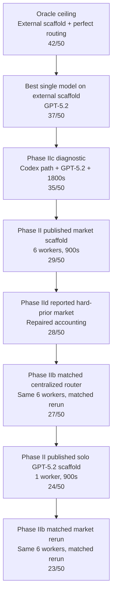
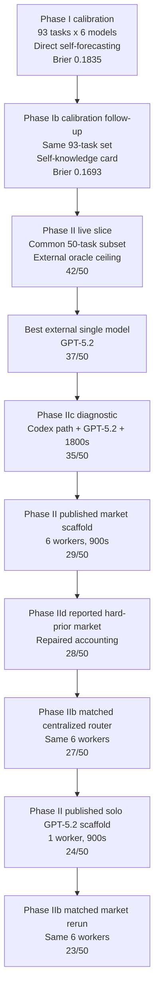

# Executive Summary: Agent Economy Research

**Last updated:** 2026-04-11
**Scope:** SWE-bench Lite evaluation on the common 50-task slice across Phase I calibration, Phase Ib self-knowledge follow-up, Phase II live scaffold runs, Phase IIa auction mechanism experiments, Phase IIb matched centralized-router baseline, Phase IIc Codex relaxed-time diagnostic, and Phase IId market calibration intervention

Can a competitive market of LLMs outperform any single model? We tested this on SWE-bench Lite -- real software engineering tasks with verifiable patches. The short answer is now more precise: diverse model pools help, and once the noisy Phase IId slice is repaired the hard-prior market becomes roughly competitive with a matched centralized router, but the main bottleneck is still weak self-knowledge in bids.

---

## 50-Task Comparison Map

This is a score-ordered map of the main 50-task results. It is not a pure one-variable ladder. The cleanest mechanism comparison inside it is **Phase IIb centralized router vs. Phase IIb market**, because those two runs hold the six-worker pool fixed and change only the chooser.

The picture to keep in mind is simple:

- the best numbers still come from stronger scaffolds or stronger information,
- the live in-house scaffold family clusters in the mid-20s,
- model diversity helps,
- the repaired hard-prior market is roughly on top of the matched centralized chooser.

---

## Phase I to Phase II Funnel

This is the simplest top-down path through the results.

The funnel makes two points at once:

- the calibration story starts on the broader 93-task set and improves before live routing improves,
- once we move to the common 50-task live slice, performance falls as the setup becomes more constrained and more realistic.

---

## Phase I: Calibration (2026-02-15)

Phase I evaluated 6 frontier models on 93 SWE-bench Lite tasks to establish the oracle ceiling and test whether self-assessed confidence could drive allocation.

The oracle ceiling (best possible model for each task) is **84%** on the 50-task subset. But self-assessed confidence turned out to be noise: most models had near-zero or negative Brier skill scores, with only Claude Sonnet 4.5 (+0.07) beating a naive base-rate predictor. Overconfident models consistently stole assignments from more capable ones.

This established the core challenge for later live routing runs: diverse workers can help, but allocation quality is bottlenecked by calibration rather than by a lack of auction machinery.

For details, see [Phase I Calibration](01_PHASE_1_CALIBRATION.md).

## Phase Ib: Self-Knowledge Calibration Intervention (2026-04-06)

We later reran the direct calibration prompt with a simple held-out self-knowledge card shown before forecasting. Each model saw a short summary of its own prior pass rate, typical confidence level, and token underestimation tendency.

This improved calibration on the full six-model, 93-task rerun:

- Brier score improved from `0.1835` to `0.1693`
- ECE improved from `0.1065` to `0.0616`
- token forecasts became less severely underestimated

The downstream auction effect was smaller than the calibration effect. The reserve-auction oracle gap narrowed slightly, but mean realized profit stayed roughly flat. This supports a narrow claim: models can use simple self-history to forecast themselves better, but current bid quality is still not strong enough to fully repair allocation.

---

## Phase II: Market vs Solo (2026-02-20)

The primary goal of Phase II was to test whether a multi-agent market with economic allocation and retry-exclusion could outperform the strongest individual frontier model on a level playing field.

The results provide directional evidence for this hypothesis: **the market beats the best solo model by 10 absolute percentage points (58% vs 48%) on identical scaffolds.** On this 50-task sample, the paired McNemar exact test is not yet conventionally significant (two-sided `p=0.3323`).

## Headline Results

We evaluated 50 tasks across four paradigms to isolate the value of the market mechanism from the noise of the scaffold:

| Execution Paradigm | Pass Rate | Absolute Passes |
| :--- | :--- | :--- |
| **Market (Our Scaffold)** | **58.0%** | 29 / 50 |
| **Solo GPT-5.2 (Our Scaffold)** | **48.0%** | 24 / 50 |
| *Solo GPT-5.2 (External Scaffold)* | *74.0%* | 37 / 50 |
| *Oracle Ceiling (External Scaffold)* | *84.0%* | 42 / 50 |

*(External Scaffold denotes standard SWE-bench setups with interactive shells, test feedback, and multi-turn iteration).*

## Key Drivers of Success

1. **Diverse-Model Retry Converts at Double the Rate**
   Both configurations use `max_attempts=2` and share the same first-attempt pass rate (18/50, 36%). The difference emerges on retry: the market's hard exclusion rule forces a *different* model on the second attempt, rescuing 11 of 32 first-attempt failures (34% rescue rate). Solo GPT-5.2's same-model retry rescues only 6 of 32 (19%). This 2x retry-conversion advantage is the primary mechanism behind the market's +10pp edge.

2. **Model Diversity Adds Measurable Value**
   In a direct head-to-head comparison on these 50 tasks, the market solved 11 tasks that Solo GPT-5.2 failed, while Solo GPT-5.2 solved only 6 tasks that the market missed. This diversity effect concentrates in symbolic reasoning domains (e.g., `sympy`), where failures are model-specific rather than universal.

## The Remaining Bottlenecks

While the market outperforms single models, it currently sits below the theoretical Oracle Ceiling (84%) due to two primary constraints:

1. **The Scaffold Gap (The Ceiling)**
   Our single-shot, raw-diff execution environment imposes a ~26 percentage point penalty compared to interactive external scaffolds (48% vs 74% for GPT-5.2). The market recovers about 5 tasks (~10pp) of this lost capability through diversity, but the rest remains blocked without scaffold upgrades (test feedback, file-editing tools).

2. **Allocation Inefficiency (The Missed Upside)**
   Both configurations share a 36% first-attempt rate, but the market has room to do much better — the oracle ceiling is 74% on these tasks with this scaffold's models. The scoring formula (`p_success * bounty - ask`) over-weights self-assessed confidence, allowing weaker but overconfident models (like GPT-5-mini, converting at 10%) to steal assignments from stronger models (like GPT-5.2, converting at 33%). Better bid calibration would push the market's first-attempt rate toward the oracle ceiling and reduce dependence on retries.

## Conclusion

On this 50-task sample, the market shows a practical gain over the strongest same-scaffold solo baseline. The remaining bottlenecks are allocation quality and scaffold limitations.

## Phase IIb: Matched Centralized-Router Baseline (2026-04-09)

Phase IIb reran the same 50-task slice with the same six workers, the same two-attempt cap, the same `900` second limit, and the same verifier. The only intended change was the chooser: the market rule on one side and a centralized router on the other.

Headline result:

| Execution Paradigm | Pass Rate | Absolute Passes |
| :--- | :--- | :--- |
| Centralized router | 54.0% | 27 / 50 |
| Market (matched rerun) | 46.0% | 23 / 50 |

This is the cleanest mechanism test we have. It weakens the claim that the raw market-clearing rule by itself is the main reason the earlier market scaffold beat the solo baseline. The stronger reading now is that model diversity helps, and that better bid priors can move the market back toward parity with or slightly above a centralized chooser.

The clearest driver of the market drop in the rerun was Gemini. Gemini became much more aggressive, won more first attempts, and then converted those wins much worse. Most of those extra losses were ordinary task failures such as malformed patches, patch-apply failures, or `900` second timeouts rather than checker corruption.

Across the matched 900-second market and centralized-router reruns together, the background harness-like non-clean attempt rate was about **6%** (`10 / 168` attempts). That is the rough noise floor to keep in mind when reading small one-task or two-task deltas. The raw Phase IId run rose well above that baseline and was later repaired.

## Phase IId: Market Calibration Intervention (2026-04-10)

Phase IId keeps the same six-worker market scaffold as Phase IIb and changes only the private bidding context. Each worker gets a held-out calibration prior before bidding, and the cost hint is separated from that note.

The early clean rerun was a targeted five-task slice chosen from cases where the older market had wins but the matched rerun had losses. After fixing the verifier cleanup path, that hard-prior rerun solved **4 / 5** tasks. We then completed the full 50-task Phase IId result by combining that validated slice with a 41-task clean continuation and a clean 4-task tail rerun.

We later repaired the remaining harness artifacts on the seven-task regression slice that had created the old raw `29 -> 24` gap. That follow-up reran the five unresolved tasks under the cleaned verifier path and a full `1800` second worker budget, then reran the remaining `astropy__astropy-12907` timeout-shaped case at the same `1800` second budget. The repaired seven-task slice recovered **4 / 7** tasks:

- `astropy__astropy-12907`
- `django__django-12308`
- `pytest-dev__pytest-7432`
- `scikit-learn__scikit-learn-13142`

| Execution Paradigm | Pass Rate | Absolute Passes |
| :--- | :--- | :--- |
| Phase II published market scaffold | 58.0% | 29 / 50 |
| Phase IIb matched centralized router | 54.0% | 27 / 50 |
| Solo GPT-5.2 on our 900s scaffold | 48.0% | 24 / 50 |
| **Phase IId reported hard-prior market result** | **56.0%** | **28 / 50** |
| Phase IIb matched market rerun | 46.0% | 23 / 50 |

The repo now reports Phase IId as `28 / 50`. That number starts from the saved raw `24 / 50` full rerun and replaces the seven-task regression slice with the repaired `4 / 7` follow-up outcomes. On that reported accounting, the hard-prior intervention moves the matched market from `23 / 50` to `28 / 50`, edges the matched centralized router at `27 / 50`, and lands one task behind the older published market scaffold result at `29 / 50`.

One caveat matters for how to compare those market numbers. The older `29 / 50` remains the repo's canonical published Phase II figure from `docs/research/data/phase2/`, but one middle raw market batch was lost earlier in the project, so that older total is preserved through the saved published per-task table rather than by rebuilding every original raw ledger. The new reported `28 / 50` Phase IId number is built from raw-ledger-confirmed repaired slices, but it is a repaired aggregate rather than a single uninterrupted 50-task rerun.

The task-level explanation is sharper now. Four of the seven old-only market losses were not stable once the harness path was repaired. The three tasks that still failed under the repaired slice were `matplotlib__matplotlib-23314`, `scikit-learn__scikit-learn-13496`, and `sympy__sympy-15345`, and those all ended as clean judged fails rather than harness artifacts. So the old raw `29 -> 24` gap now narrows to a reported `29 -> 28` gap, with the remaining difference concentrated in a small set of clean task failures rather than verifier noise.

## Phase IIc: Codex + GPT-5.2 With a Longer Budget (2026-04-02)

We later reran the same 50-task slice through the Codex worker path with the underlying model fixed to **GPT-5.2**, but doubled the per-task execution budget from **900 seconds** to **1800 seconds**.

That run finished at **35 / 50 passes (70%)**, ahead of both published same-task baselines:

| Execution Paradigm | Pass Rate | Absolute Passes |
| :--- | :--- | :--- |
| Codex + GPT-5.2 (relaxed 1800s budget) | 70.0% | 35 / 50 |
| Market (published 900s benchmark) | 58.0% | 29 / 50 |
| Solo GPT-5.2 (published 900s benchmark) | 48.0% | 24 / 50 |

This result should **not** replace the published 900-second benchmark. It answers a different question: what happens if the same model family gets more time and uses the Codex execution path? The answer is that the Codex setup looks much more speed-limited than capability-limited. The biggest gains came in `django` and `sympy`, while `matplotlib` remained a weak spot.

Of the **35** passing tasks in this relaxed-time follow-up, **20** finished after the original **900-second** budget and **15** finished within it. So most of the gain came from the extra runway, not from a hidden apples-to-apples improvement under the original limit.

### Efficiency Snapshot

| Execution Paradigm | Budget / task | Passes | Attempts | Total tokens | Tokens / pass | Penalties / task |
| :--- | :--- | ---: | ---: | ---: | ---: | ---: |
| Market (published) | 900s | 29 / 50 | 82 | ~5.82M* | ~200.8k* | 47.6* |
| Solo GPT-5.2 (published) | 900s | 24 / 50 | 82 | 4.37M | 182.2k | 64.4 |
| Codex + GPT-5.2 (relaxed follow-up) | 1800s | 35 / 50 | 66 | 321.3M | 9.18M | 3920.5 |

The relaxed-time Codex run won on raw pass count, but it did so with a much larger time and token budget. It used about **74x** as many tokens as the published solo GPT-5.2 run and about **55x** as many as the published market run.

`Penalties / task` uses the repo's internal accounting units, not literal billing.

*Market token and penalty figures come from the published Phase II rollup and appendix. The middle 20-task raw market batch was lost, so the fine-grained run summaries for that batch are no longer recoverable.*

For details, see [Phase II Codex Relaxed-Time Follow-Up](09_PHASE_2_CODEX_RELAXED_TIME_GPT52_2026-04-02.md).

---

## Phase IIa: Informed Competitive Auctions (2026-02-25/26)

Phase IIa investigated the allocation bottleneck identified in Phase II through three experiments testing how LLMs bid under different economic framings: first-price, second-price, and second-price with an explicit breakeven formula. All used 50 SWE-bench Lite tasks, 3 models (GPT-5.2, Opus 4.5, Gemini 3 Pro), and reserve levels of $5 and $10.

### Key findings

**Prompt design matters more than mechanism design.** Across three experiments, allocation accuracy stayed at 62--70% regardless of payment rule or reserve conditions. The bottleneck is `p_success` self-assessment quality, not the auction mechanism. But *how* models are told to bid changes their behaviour dramatically.

**Reserve anchoring is curable with explicit formulas.** Ask ratio ($10/$5) trajectory across experiments:

| Experiment | GPT-5.2 ratio | Opus ratio | Gemini ratio |
|---|---|---|---|
| Exp 1: First-price | 2.21x | 1.61x | 1.05x |
| Exp 2: Second-price ("bid true cost") | 4.55x | 1.10x | 1.60x (n=12) |
| Exp 3: Second-price (explicit formula) | **0.97x** | **0.99x** | **1.08x** |

Telling GPT-5.2 to "bid its true cost" made anchoring *worse*. Giving it the breakeven formula made it *perfect*. Opus responded correctly to Vickrey incentives even without the formula. Gemini was price-rigid throughout.

**Cheap bidders dominate but don't always deliver.** With all three models competing in Exp 3, Gemini wins 85--92% of tasks by bidding $0.20 vs Opus's $0.37 and GPT-5.2's $0.48. But it wins tasks beyond its capability, pulling 3-model allocation accuracy (62--63%) below the 2-model results (66--68%). A well-designed market needs quality signals beyond price.

**Reserve visibility is a non-issue with the right prompt.** In Exp 3, all three models bid at breakeven regardless of whether they see the budget. The reserve anchor that dominated Exp 1 is entirely a product of ambiguous pricing instructions.

**Models need computational structure, not strategic advice.** The explicit formula fixed two problems at once: anchoring collapsed (all models near 1.0x) and penalty inclusion jumped from ~28% to ~97% of bids above breakeven. LLMs follow formulas well but infer economic strategy poorly.

For full details, see the [Phase IIa report](08_PHASE_2A_COMPETITIVE_AUCTION_2026-02-26.md).
